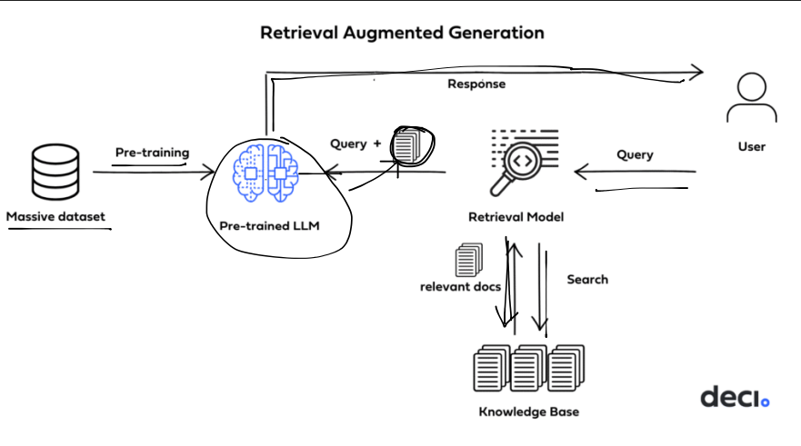
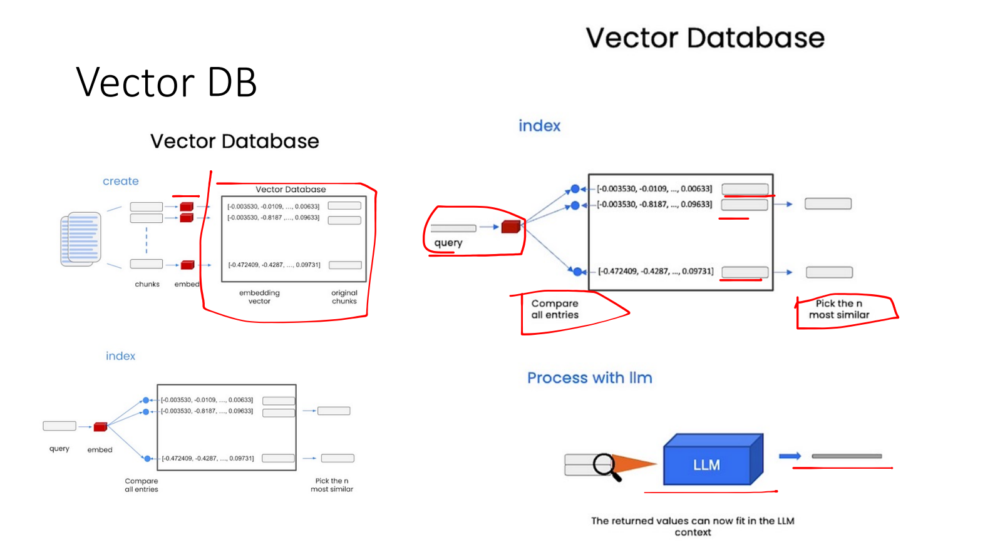
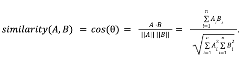

---

Hãy tưởng tượng bạn có một con chatbot bình thường, hỏi gì trả lời nấy. Nhưng khi bạn hỏi nó:

Hiếu🧑: _"Cách nấu bún mắm chuẩn miền Tây?"_  
Bot 🤖: _"Tôi không biết, nhưng tôi có thể tạo một công thức ngẫu nhiên cho bạn!"_


Bây giờ, nếu chatbot dùng **RAG (Retrieval-Augmented Generation)**, nó sẽ thông minh hơn:

Hiếu🧑: _"Cách nấu bún mắm chuẩn miền Tây?"_  
Bot 🤖 (bắt đầu tra cứu từ tài liệu chất lượng):  
*"Theo sách _Bí kíp gia truyền của bà ngoại_, để có tô bún mắm chuẩn vị, bạn cần:

👨‍🍳 **Cách nấu:**  
1️⃣ **Nấu nước lèo:** Nấu mắm cá với nước, lọc bỏ xác để có nước lèo đậm đà.  
2️⃣ **Xào sả, tỏi:** Phi thơm lên rồi bỏ nước lèo vô, cho thêm nước dừa tươi cho ngọt.  
3️⃣ **Thả topping:** Cho tôm, mực, heo quay, cà tím vào nồi. Nêm nếm cho hợp khẩu vị.  
4️⃣ **Ăn thôi:** Bỏ bún vô tô, chan nước lèo, thêm topping, rau sống. Thêm tí ớt chấm mắm me là hết bài!

**RAG đã biến chatbot từ "hỏi gì cũng không biết" thành một "bà ngoại online" giải quyết được vấn đề liên quan**!


## Tổng quan về RAG
-   **Retrieval-Augmented Generation (RAG)** là một kỹ thuật giúp nâng cao khả năng của mô hình sinh (language model generation) kết hợp với tri thức bên ngoài (external knowledge).

-   Phương pháp này thực hiện bằng cách truy xuất thông tin liên quan từ kho tài liệu (tri thức) và sử dụng chúng cho quá trình sinh câu trả lời dựa trên LLMs.


## RAG đã nổi lên như thế nào?

- Với sự ra đời của những mô hình ngôn ngữ lớn như GPT, BERT, etc. Mặc dù giải quyết được những vấn đề khác nhau nhưng các mô hình LLMs vẫn gặp vấn đề về "ảo giác" (hallucination), các mô hình sinh ra câu trả lời một cách mơ hồ và độ chính xác rất thấp.

- Bên cạnh đó, những doanh nghiệp hay trường học có những tài liệu nội bộ thì việc các LLMs trả lời một cách chính xác thì gần như là không thể.

- Phương pháp **Retrieval-Augmented Generation (RAG)** được phát triển nhằm khắc phục các hạn chế của LLMs. Cách tiếp cận này bao gồm việc tạo một chỉ mục cho từng đoạn văn trong tài liệu. Khi nhận được truy vấn, hệ thống sẽ tìm kiếm và trích xuất các đoạn văn có độ tương đồng, sau đó chuyển chúng vào mô hình ngôn ngữ lớn để tạo phản hồi. Bằng cách này, chỉ những thông tin quan trọng mới được cung cấp thay vì toàn bộ tài liệu, giúp giảm tải cho LLMs và nâng cao chất lượng nội dung sinh ra.

## Cấu trúc cơ bản của RAG

Để tận dụng được nguồn dữ liệu do các hệ thống LLMs cung cấp và thông tin, dữ liệu bổ sung trong ngữ cảnh cụ thể giúp mở rộng và nâng cao chất lượng tri thức LLMs một cách hiệu quả bằng cách sử dụng RAG. 

Quá trình đầu tiên để có thể xây một chatbot áp dụng phương pháp RAG đó là **Indexing**. **Indexing** là quá trình tổ chức, tối ưu hoá và chuẩn bị dữ liệu để hỗ trợ truy xuất hiệu quả.

Bắt đầu với việc thu thập dữ liệu từ cơ sở dữ liệu nội bộ. Sau khi tiền xử lí dữ liệu, đến với việc chia nhỏ các đoạn văn bản (chunks) sao cho phù hợp với giới hạn của LLMs

Các đoạn văn bản này chuyển thành dạng vector bằng cách Embedding thông qua các mô hình như GPT, BERT, etc. giúp hệ thống hiểu và truy xuất dựa trên ngữ nghĩa.



Bước tiếp theo ta xây dựng truy vấn để Chatbot có thể truy vấn dữ liệu liên quan đến câu hỏi của người dùng. Khi người dùng đặt câu hỏi thì hệ thống sẽ tự động chuyển câu hỏi thành dạng vector tương tự đối với các đoạn văn bản trong database. Sau đó, vector câu hỏi được tính toán độ tương đồng với từng vector trong database bằng **Consine Similarity** 




Bước tiếp theo, ta đưa các vector có độ tương đồng cao và prompt của người dùng qua mô hình ngôn ngữ như GPT, BERT, etc. để sinh câu trả lời một cách mạch lạc.
## Các vấn đề với RAG
### 1. Chất lượng của dữ liệu truy xuất
- Nếu hệ thống truy xuất dữ liệu không thể tìm thấy dữ liệu phù hợp hay tìm thấy dữ liệu sai lệch, mô hình có thể sinh ra kết quả không chính xác
- Dữ liệu nguồn có thể có thể chứa thông tin không chính xác, ảnh hưởng đến chất lượng đầu ra của mô hình.

### 2. Tốc độ và hiệu suất
- Quá trình truy xuất dữ liệu từ kho dữ liệu có thể làm chậm tốc độ phản hồi so với mô hình sinh đơn thuần.
- Khi lượng dữ liệu lớn, việc tìm kiếm thông tin phù hợp có thể gây ra độ trễ cao.
### 3. Vấn đề về kết hợp thông tin (Fusion Problem)
- Khi truy xuất nhiều tài liệu, mô hình có thể gặp khó khăn trong việc tổng hợp và chọn lọc thông tin phù hợp để tạo ra câu trả lời hợp lý.
- Dữ liệu truy xuất có thể mâu thuẫn, gây khó khăn trong việc chọn lựa thông tin đáng tin cậy.
### 4. Bảo mật và quyền riêng tư
- Nếu kho dữ liệu chứa thông tin nhạy cảm, việc sử dụng RAG có thể dẫn đến rò rỉ dữ liệu.
- Hệ thống có thể truy xuất thông tin không nên được tiết lộ, gây ra rủi ro bảo mật.
### 5. Hiệu ứng Hallucination (Ảo giác thông tin)
 Mặc dù RAG được thiết kế để giảm hiện tượng hallucination (sinh thông tin sai), nhưng nếu thông tin truy xuất không đủ chính xác, mô hình vẫn có thể tự "bịa" thêm thông tin không có trong tài liệu gốc.
### 6. Độ phụ thuộc vào hệ thống truy xuất
- Nếu hệ thống truy xuất không được tối ưu hóa tốt (ví dụ: thiếu chiến lược ranking hiệu quả, index không đầy đủ), mô hình có thể không lấy được dữ liệu phù hợp.
- Nếu truy xuất thất bại hoặc không có dữ liệu, mô hình có thể gặp khó khăn trong việc tạo ra câu trả lời hợp lý.
### 7. Khả năng cập nhật kiến thức
- RAG giúp mô hình cập nhật thông tin mà không cần huấn luyện lại, nhưng nếu kho dữ liệu không được cập nhật thường xuyên, hệ thống vẫn có thể trả lời bằng thông tin cũ.
- Nếu dữ liệu mới chưa được index hoặc chưa được xử lý đúng cách, mô hình có thể bỏ lỡ các thông tin quan trọng.


## Xây dựng chatbot đơn giản với RAG
### Bước 1: Load model từ Huggingface 

```python
import torch
from transformers import AutoTokenizer, AutoModelForCausalLM, AutoConfig,pipeline,BitsAndBytesConfig

model_path="vilm/vinallama-2.7b-chat"

# Setup tokenizer
tokenizer = AutoTokenizer.from_pretrained(model_path, trust_remote_code=True, token = token)


# Seting config
config = AutoConfig.from_pretrained(model_path, trust_remote_code=True, token = token)
config.init_device = "cuda"
config.temperature = 0.1

bnb_config = BitsAndBytesConfig(
                                load_in_4bit=True,
                                bnb_4bit_use_double_quant=True,
                                bnb_4bit_quant_type="nf4",
                                bnb_4bit_compute_dtype=torch.bfloat16,
                               )


model = AutoModelForCausalLM.from_pretrained(
    model_path,quantization_config=bnb_config,
    config=config,
    trust_remote_code=True,
    token = token
)

```
Ở đây ta quantization vinallama giúp model nhẹ hơn. Bạn có thể tham khảo những model khác trên huggingface

### Bước 2: Chia nhỏ đoạn văn bản (Chunks)

```python
from langchain.text_splitter import CharacterTextSplitter
def get_text_chunks(text):
    text_splitter = CharacterTextSplitter(
        separator="\n",
        chunk_size=1000,
        chunk_overlap=200,
        length_function=len
    )
    chunks = text_splitter.split_text(text)
    return chunks
```

### Bước 3: Tạo vector database

```python
from langchain.vectorstores import FAISS
from langchain.embeddings import OpenAIEmbeddings, HuggingFaceInstructEmbeddings, HuggingFaceEmbeddings
from langchain.embeddings import OpenAIEmbeddings, HuggingFaceInstructEmbeddings, GPT4AllEmbeddings
from langchain.vectorstores import FAISS
embeddings = GPT4AllEmbeddings()

raw_text = """

Ngày 22/12, đại diện BCH Công đoàn cơ sở SHB đã đến thăm hỏi, động viên và trao quà cho gia đình chị Phạm Thị Mai - SHB TTKD - CBNV có hoàn cảnh đặc biệt. Đây cũng là một trong những truyền thống tốt đẹp của người SHB, luôn sẵn sàng giúp đỡ đồng nghiệp không may gặp khó khăn trong cuộc sống.
Tháng 5/2023 vừa qua, cháu Nguyễn Bảo Nguyên - con trai chị Phạm Thị Mai, Kiểm soát viên tại SHB TTKD, trên đường đi học về không may bị thanh sắt từ công trường đang thi công rơi xuống đầu gây chấn thương sọ não và giám định thương tật là 49% (Theo đánh giá của viện khoa học hình sự). Trải qua 02 ca phẫu thuật để ghép xương sọ nhân tạo, sức khỏe cháu Nguyên vẫn chưa ổn định, ảnh hưởng đến tình hình học tập và vấn đề tự sinh hoạt cá nhân. Chị Mai cũng là mẹ đơn thân và trụ cột kinh tế chính trong gia đình nên cuộc sống rất khó khăn và vất vả.


Em Nguyễn Văn H là học sinh cá biệt trong lớp, thích bạo lực, thích thể hiện gây sự chú ý, thường xuyên bị kích động không kiềm chế bản thân, 
H thường hét to trong giờ học mỗi khi không hài lòng về bạn. H thông minh, nhưng chưa bao giờ cố gắng tập trung trong học tập, 
em lên trường chủ yếu để vui chơi, quấy rối bạn bè. Qua tìm hiểu thì hoàn cảnh gia đình của em là mẹ mất cách đây 3 năm, em sống với cha, 
cha em thường xuyên vắng nhà do bận lo làm ăn, cha không có thời gian gần gũi, quan tâm em.

"""

# get the text chunks
text_chunks = get_text_chunks(raw_text)

# create vector store
#vectorstore = get_vectorstore(text_chunks)
vectorstore = FAISS.from_texts(texts=text_chunks, embedding=embeddings)

db = vectorstore.as_retriever(search_kwargs={'k': 1}) # lấy 1 tài liệu liên quan nhất
```
### Bước 4: Tạo hệ thống truy xuất

```python
from langchain.chains import RetrievalQA, RetrievalQAWithSourcesChain
from langchain import PromptTemplate
import transformers
from langchain_huggingface import HuggingFacePipeline

template = prompt = """<|im_start|>system
Bạn là một trợ lí AI hữu ích. Hãy trả lời người dùng một cách chính xác.
<|im_end|>
<|im_start|>user
{context}<|im_end|>
<|im_start|>assistant"""


mistral_llm = HuggingFacePipeline(
    pipeline=pipeline(
        "text-generation",
        model=model,  
        tokenizer=tokenizer, 
        trust_remote_code=True,
        max_new_tokens=100,
        repetition_penalty=1.1
    )
)

prompt = PromptTemplate(template=template, input_variables=["context"]) 
qa_chain = RetrievalQA.from_llm(llm=mistral_llm,
                                retriever=db,
                                return_source_documents=True,
                                verbose=True,
                                prompt = prompt
)
```
```python
query = "Nguyễn Văn H là ai?"

sol=qa_chain({"query": query})
sol
```

### Kết quả


```
{'query': 'Nguyễn Văn H là ai?',
 'result': '<|im_start|>system\nBạn là một trợ lí AI hữu ích. Hãy trả lời người dùng một cách chính xác.\n<|im_end|>\n<|im_start|>user\nContext:\nEm Nguyễn Văn H là học sinh cá biệt trong lớp, thích bạo lực, thích thể hiện gây sự chú ý, thường xuyên bị kích động không kiềm chế bản thân, \nH thường hét to trong giờ học mỗi khi không hài lòng về bạn. H thông minh, nhưng chưa bao giờ cố gắng tập trung trong học tập, \nem lên trường chủ yếu để vui chơi, quấy rối bạn bè. Qua tìm hiểu thì hoàn cảnh gia đình của em là mẹ mất cách đây 3 năm, em sống với cha, \ncha em thường xuyên vắng nhà do bận lo làm ăn, cha không có thời gian gần gũi, quan tâm em.<|im_end|>\n<|im_start|>assistant\nCó vẻ như em H đang trải qua một số vấn đề cá nhân và cảm xúc. Sự thiếu quan tâm từ cha và việc phải đối mặt với mất mát của mẹ có thể góp phần vào hành vi hung dữ và hành vi gây hấn của em. Cha nên ưu tiên dành thời gian chất lượng cho em bằng cách liên lạc thường xuyên hơn và hỗ trợ tinh thần. Ngoài ra, các chuyên gia sức khỏe tâm thần có thể giúp hướng dẫn em đến liệu pháp hoặc các chương',
 'source_documents': [Document(id='2cf0a1af-0a4c-49ea-857b-941e9095365e', metadata={}, page_content='Em Nguyễn Văn H là học sinh cá biệt trong lớp, thích bạo lực, thích thể hiện gây sự chú ý, thường xuyên bị kích động không kiềm chế bản thân, \nH thường hét to trong giờ học mỗi khi không hài lòng về bạn. H thông minh, nhưng chưa bao giờ cố gắng tập trung trong học tập, \nem lên trường chủ yếu để vui chơi, quấy rối bạn bè. Qua tìm hiểu thì hoàn cảnh gia đình của em là mẹ mất cách đây 3 năm, em sống với cha, \ncha em thường xuyên vắng nhà do bận lo làm ăn, cha không có thời gian gần gũi, quan tâm em.')]}
```
## Tài liệu và nguồn tham khảo
[ProntX](https://protonx.coursemind.io/intro?lang=vi)
[Mì AI](https://github.com/thangnch/MiAI_Langchain_RAG)